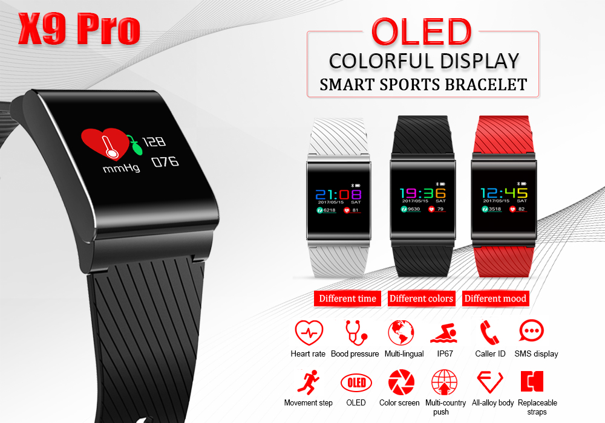
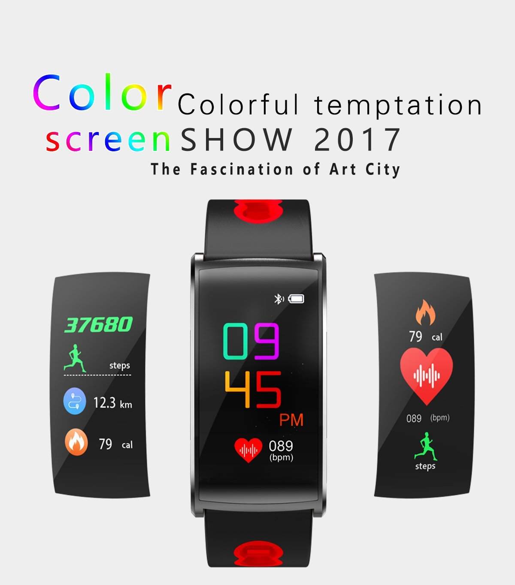
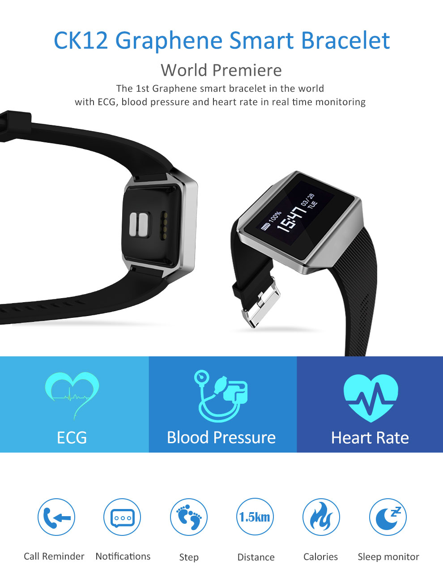
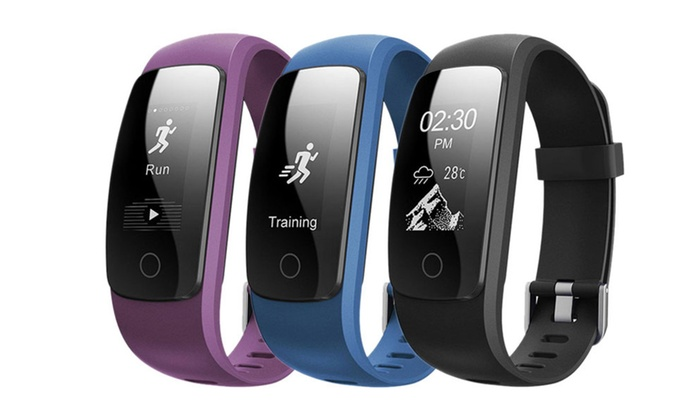
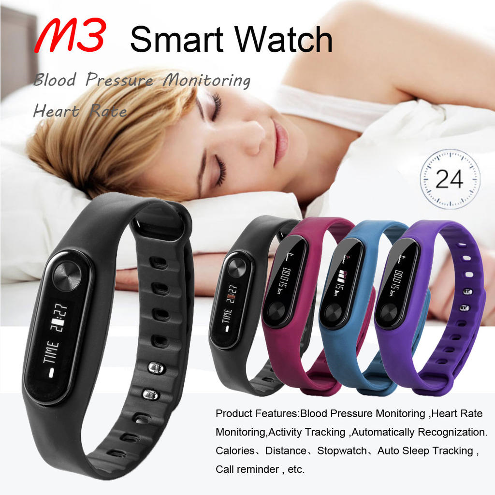
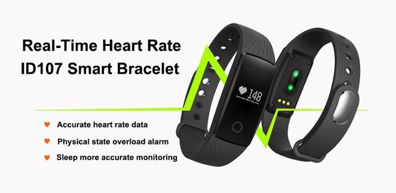

nRF52/nRF51 Smartwatches and Activity Trackers for Wearable Device Development
=============================

Resources for reverse engineering generic [Nordic Semiconductor](https://www.nordicsemi.com) nRF52832 and nRF51822 ARM Cortex based Smartwatches and activity trackers. These devices are my primary development platform for rapid prototyping of wearables. You get a nRF52832 ARM Cortex M4 SoC MCU, color OLED display, accelerometer, HR LED, HR photodetector, vibration motor, LiPo battery, battery charger, injection molded enclosure and strap for $30-$40. Using these devices as a development platform means faster, more ambitious prototyping - I treat them as disposable and have personally destroyed more than 20 over the past two years. These devices can be programmed using [nRF5X ArduinoCore](https://github.com/sandeepmistry/arduino-nRF5), [ARM Mbed](https://www.mbed.com) or directly with the [Nordic nRF5X SDK](http://developer.nordicsemi.com/nRF5_SDK/doc/) using ARM [Keil](http://www.keil.com/) or the [GNU ARM Embedded](https://launchpad.net/gcc-arm-embedded) GCC toolchain. Devices can be flashed using [nRFgo Studio](https://www.nordicsemi.com/eng/Products/2.4GHz-RF/nRFgo-Studio), [nRFjprog Win](https://www.nordicsemi.com/eng/nordic/Products/nRF52-DK/nRF5x-Command-Line-Tools-Win32/51499) , [nRFjprog Linux](https://www.nordicsemi.com/eng/nordic/Products/nRF51822/nRF5x-Command-Line-Tools-Linux64/51386) , [nRFjprog Mac](https://www.nordicsemi.com/eng/nordic/Products/nRF51822/nRF5x-Command-Line-Tools-OSX/53402) , [OpenOCD](http://openocd.org/) and [ArduinoCore](https://github.com/sandeepmistry/arduino-nRF5) Arduino IDE Plugin. I use a SEGGER J-Link programmer, but if you want to save money and have a $4 'Blue Pill' STM32 board lying around you can turn it into an ARM programmer/debugger, the "Black Magic Probe": https://medium.com/@paramaggarwal/converting-an-stm32f103-board-to-a-black-magic-probe-c013cf2cc38c also https://hackaday.com/2016/12/02/black-magic-probe-the-best-arm-jtag-debugger .

NOTE: I will try to keep purchase links updated but one can only do so much. DuckDuckGo/Google search is your friend. I have worked with the X9 more than any other device and have placed X9 related files in the root of this repo. I am still in the process of hacking components for other listed devices, and you are of course welcome to contribute!

X9 Pro nRF52832 Based Color Smartwatch 
------------

### Purchase Links
https://www.ebay.com/itm/X9Pro-Bluetooth-Smart-Watch-Heart-Rate-Monitor-Bracelet-Fitness-Activity-Tracker/372268058270
https://www.ebay.com/itm/LEMFO-X9-Pro-Sport-Bracelet-Activity-Tracker-Blood-Pressure-Band-For-Android-iOS/282783676442
https://www.ebay.com/itm/X9Pro-Sports-Smart-Bracelet-Activity-Tracker-Calorie-Counter-Heart-Rate-Monitor/192510003251
http://www.globalsources.com/gsol/I/Smart-bracelet/p/sm/1153444500.htm
https://www.amazon.com/Gentman-Colorful-Wristwatch-Pressure-Smartwatch/dp/B074J2DLBT/ref=sr_1_7
https://de.aliexpress.com/item/New-Original-X9-PRO-Smart-Watch-Sport-Heartrate-Blood-Pressure-Oxygen-Oximeter-Sport-Bracelet-Watch-intelligent/32823945075.html

N68 nRF52832 Based Color Smartwatch 
------------

### Purchase Links
https://www.aliexpress.com/item/N68-Smart-Bracelet-Blood-Pressure-Dynamic-Heart-Rate-Activity-Fitness-Tracker-Smart-Wristband-Pedometer-Waterproof-Smart/32861208616.html
https://www.aliexpress.com/item/Langtek-N68-Smart-Band-Bluetooth-Bracelet-Touch-Screen-Heart-Blood-Pressure-Monitor-Smart-Band-Wristband-Sport/32856425541.html
https://www.ebay.com/itm/LEMFO-N68-Smart-Watch-Band-Heart-Rate-Activity-Tracker-Wristband-For-Andriod-iOS/312017440612
https://www.ebay.com/itm/Lemfo-N68-Bluetooth-Waterproof-Activity-Tracker-Heart-Rate-Pedometer-Smart-Band/282777153434
https://www.amazon.com/Bracelet-Activity-Waterproof-Bluetooth-Wireless/dp/B078W28FYH/ref=sr_1_1

CK12 nRF52832 Based ECG Smartwatch 
------------

### Purchase Links
https://www.aliexpress.com/item/Hot-Smart-Watch-CK12-Graphene-ECG-Blood-Pressure-Heart-Rate-Smart-Bracelet-Sport-Watch-Pedometer-Call/32830280936.html
https://www.ebay.com/itm/CK12-Smart-Wrist-Watch-ECG-Heart-Rate-Blood-Pressure-Monitor-Sleep-Waterproof/273154151326
https://www.ebay.com/itm/CK12-ECG-Blood-Pressure-Heart-Rate-Smart-Bluetooth-Bracelet-Matte-for-Android/372178718406
https://www.aliexpress.com/item/Teamyo-CK12-Graphene-ECG-Smart-Band-Oxygen-Pressure-Monitor-Sport-Smart-Wristband-Waterproof-Fitness-Tracker-Bluetooth/32862762634.html

ID107 Plus nRF52832 Based Smartwatch 
------------

### Purchase Links
https://www.aliexpress.com/item/YurKem-ID107-Plus-HR-Smart-Band-Bluetooth-4-0-Answer-Call-GPS-Smart-Bracelet-Heart-Rate/32811734484.html
https://www.aliexpress.com/item/Smartch-ID107-Plus-HR-Bluetooth-Smart-Bracelet-Heart-Rate-Monitor-Multi-sports-Cardio-Fitness-Guided-Breathing/32850167271.html
https://www.ebay.com/itm/ID107-Plus-IP67-SmartWatch-Sleep-Activity-Tracker-Fitness-Heart-Rate-Call-SMS/253195626491
https://www.ebay.com/itm/Fitness-Tracker-JELEGANT-ID107-Plus-HR-Smart-Bracelet-Activity-Tracker-Hear/292493668861

M3 nRF51822 Based Mini Smartwatch 
------------

### Purchase Links
https://www.aliexpress.com/item/HL-2017-M3-Sports-Smart-Watch-Heart-Rate-Calories-Wrist-Watch-Smart-Bracelet-Watch-ma29-Levert/32804495965.html
https://www.aliexpress.com/store/product/Smart-Watch-Wrist-Band-Blood-Pressure-Heart-Rate-Monitor-M3-Bracelet-Sport-Activity-Clock-Wristband-Bluetooth/1961463_32803053240.html
http://techshopstore.com/products/m3-ip67-life-waterproof-sport-smart-wristbands-heart-rate-calories-wrist-watch-smart-bracelet-watch-0-69-inch-hd-for-ios-android/
https://www.amazon.com/Aurorax-Fitness-Waterproof-Tracker-Monitor/dp/B0765RG26M/ref=sr_1_5

ID107 nRF51822 Based Smartwatch 
------------

### Purchase Links
https://www.aliexpress.com/item/ID107-Smart-Band-Smartband-Heart-Rate-Monitor-Wristband-Fitness-Flex-Bracelet-for-Android-iOS-PK-xiomi/32812006895.html
https://www.aliexpress.com/item/Waterproof-Heart-Rate-Monitor-Smart-Band-ID107-Fitness-Tracker-Smart-Bracelet-Watch-OLED-Smart-Wristband-for/32790006100.html
https://www.ebay.com/itm/ID107-Heart-Rate-Smart-Watch-Bracelet-Fitness-Activity-Tracker-Sleep-Monitor-NEW/182852498159
https://www.ebay.com/itm/ID107-Bluetooth-Smart-Watch-Fitness-Activity-Tracker-Pedometer-Calories-Counter/132232187828
https://www.amazon.com/Bluetooth-Bracelet-Monitor-Wristband-Smartphone/dp/B01DF2H732/ref=sr_1_1

I5 Plus nRF51822 Based Activity Tracker 
------------

### Purchase Links (around 15$)
https://de.aliexpress.com/item/Smart-Armband-iwown-i5-Plus-Fitness-Tracker-Armband-Bluetooth-4-0-Aktivit-t-Tracker-Smart-Band/32849774968.html?spm=a2g0x.search0104.3.1.17087a35gmSOzc&ws_ab_test=searchweb0_0%2Csearchweb201602_2_10320_10152_10151_10065_10321_10344_10068_10342_10547_10343_10322_10340_10548_10341_10193_10696_10194_10084_10083_10618_10304_10307_10302_10059_308_100031_10319_10103_10624_10623_10622_10621_10620_10814_10815%2Csearchweb201603_25%2CppcSwitch_7&algo_expid=0208a662-cba1-4084-8c23-511d537f2113-0&algo_pvid=0208a662-cba1-4084-8c23-511d537f2113&priceBeautifyAB=0

https://de.aliexpress.com/item/Original-Bluetooth-4-0-Waterproof-Touch-Screen-Fitness-Tracker-Health-Smart-Bracelet-Wristband-I5-IWOWN-Smart/32678775224.html?spm=a2g0x.search0104.3.56.17087a35gmSOzc&ws_ab_test=searchweb0_0,searchweb201602_2_10320_10152_10151_10065_10321_10344_10068_10342_10547_10343_10322_10340_10548_10341_10193_10696_10194_10084_10083_10618_10304_10307_10302_10059_308_100031_10319_10103_10624_10623_10622_10621_10620_10814_10815,searchweb201603_25,ppcSwitch_7&algo_expid=0208a662-cba1-4084-8c23-511d537f2113-10&algo_pvid=0208a662-cba1-4084-8c23-511d537f2113&priceBeautifyAB=0

## Special Thanks
Special thanks to all the members of the smartwatch slack group ([@rogerclarkmelbourne](https://github.com/rogerclarkmelbourne), [@goran-mahovlic](https://github.com/goran-mahovlic), [@micooke](https://github.com/micooke), @olivier, @marvin, [@floe](https://github.com/floe), the [nRF51822 smart watch Gitter Lobby](https://gitter.im/nRF51822-Arduino-Mbed-smart-watch/Lobby), to @goran-mahovlic and @rogerclarkmelbourne for the KX022 accelerometer driver, to [@sandeepmistry](https://github.com/sandeepmistry) for the awesome ArduinoCore Nordic SDK wrapper and [Lampert](http://glampert.com/about/) for his awesome [light saber WebGL 3D model](http://glampert.com/2015/06-07/webgl-lightsaber/). [Roger Clark](http://www.rogerclark.net) in particular has done a lot of [cool stuff with Nordic activity trackers](http://www.rogerclark.net/new-nrf52832-based-smart-watch-available/), check out his work!
